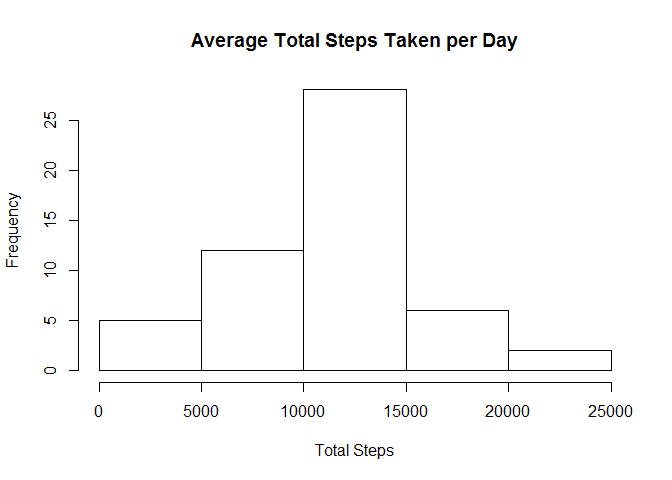
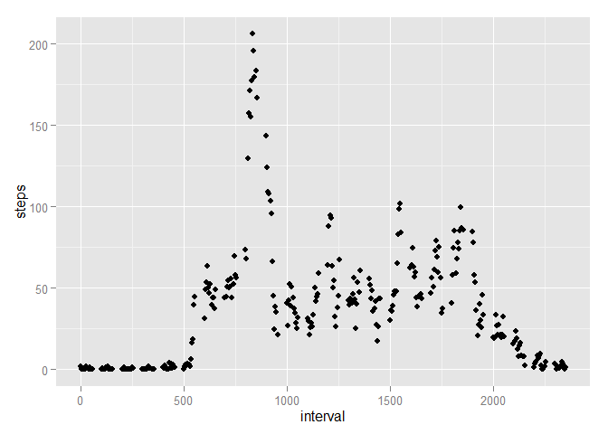
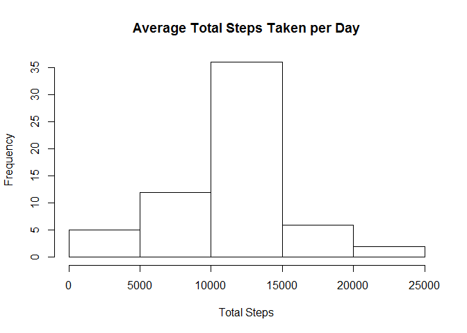

# Reproducible Research: Peer Assessment 1

This is an R Markdown document created for Peer Assesment 1 in the Coursera course Reproducible Research by Johns Hopkins University. 
## Loading and Preprocessing the Data
First, change the working directory to the site of the file and load the data set

```r
library(dplyr)
```

```
## 
## Attaching package: 'dplyr'
## 
## The following objects are masked from 'package:stats':
## 
##     filter, lag
## 
## The following objects are masked from 'package:base':
## 
##     intersect, setdiff, setequal, union
```

```r
library(ggplot2)
setwd("C:/Users/mcrai_000/Documents/R")
activity <- read.csv('activity.csv')
activity <- tbl_df(activity)
```

## What is mean total number of steps taken per day?
Plot A historgram showing the average number of steps per day

```r
activty1 <- filter(activity, steps >= 0)
activity2 <- summarise(group_by(activty1, date), totalsteps = sum(steps))
hist(activity2$totalsteps, main = "Average Total Steps Taken per Day", xlab = "Total Steps")
```

 

What are the mean and median number of steps each day?

```r
mean1 <- mean(activity2$totalsteps)
median1 <- median(activity2$totalsteps)
mean1
```

```
## [1] 10766.19
```

```r
median1
```

```
## [1] 10765
```
## What is the average daily activity pattern?
Plot a time series of the total number of steps taken during each interval averaged across each interval. Also, return the interval with the highest number of steps taken.

```r
activityint <- summarise(group_by(activty1, interval), mean(steps))
names(activityint) <- c("interval", "steps")
qplot(interval, steps, data = activityint, type = "1")
```

 

```r
activityint <- arrange(activityint, desc(steps))
activityint[1,1]
```

```
## Source: local data frame [1 x 1]
## 
##   interval
## 1      835
```
## Imputing missing values
Now we want to impute the missing values of the original data set.
First, find the number of missing observations

```r
sum(is.na(activity$steps))
```

```
## [1] 2304
```

Strategy to impute missing values is to replace NA with the mean number of steps taken for all intervals across all days.

```r
imputedsteps = mean(activty1$steps)
activity3 <- tbl_df(activity)
activity3[is.na(activity3)] <- imputedsteps
```
Now we want to compare the frequency, mean, and median of average steps taken per day to the case where NAs were ignored.


```r
activity3 <- summarise(group_by(activity3, date), totalsteps = sum(steps))
hist(activity3$totalsteps, main = "Average Total Steps Taken per Day", xlab = "Total Steps")
```

 

```r
mean2 <- mean(activity3$totalsteps)
median2 <- median(activity3$totalsteps)

mean1 - mean2
```

```
## [1] 0
```

```r
median1 - median2
```

```
## [1] -1.188679
```
As can be see from the above analysis, the chosen basic method for imputing the mean does not change the mean. It does however, change the median number of steps by 1.188.

## Are there differences in activity patterns between weekdays and weekends?
